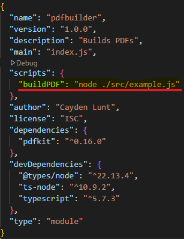

# PDFBuilder

## Description
Built to simplify the creation of PDFs via pdfkit.

## Initialization
1. ```batch
    git clone https://github.com/Hibob555556/PDFBuilder.git
   ```

2. ```batch
    npm i
   ```

3. ```batch 
    npm run buildPDF
   ```

## Example
1. Create your Javascript file (index.js) in the root directory

2. ```javascript
   // import needed deps
   import genPdf from "./genPdf.js";
   
   let pdf = genPdf.createPDF();                       // Create a PDF to modify    
   pdf.fontSize(25).text('Hello, PDF!', 100, 100);     // Write text to the PDF
   genPdf.savePDF(pdf);                                // save the PDF
   ```

3. Update this line in the package.json file with the name and location of your index.js file
    - 